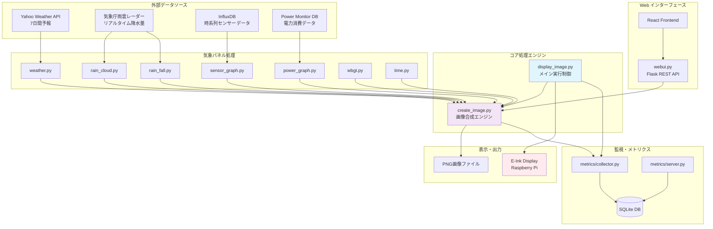
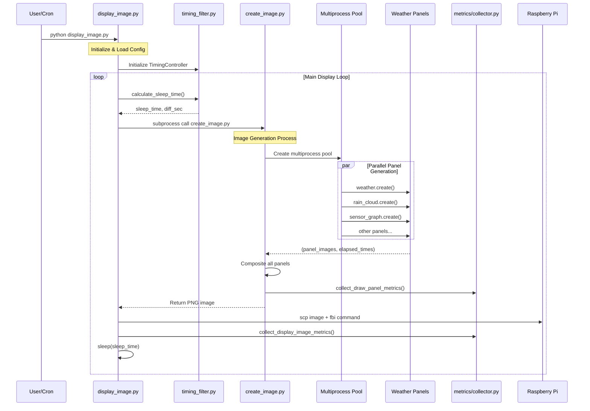
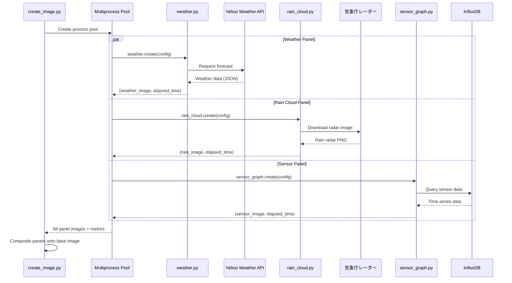

# Architecture

E-Ink Weather Panel のアーキテクチャ詳細ドキュメント。

## 目次

- [システム概要](#システム概要)
- [コアコンポーネント](#コアコンポーネント)
- [気象パネル](#気象パネル)
- [サポートモジュール](#サポートモジュール)
- [データフロー](#データフロー)
- [コードパターン](#コードパターン)
- [エラーコード](#エラーコード)

## システム概要

```
src/
├── create_image.py              # 画像生成エンジン（マルチプロセス）
├── display_image.py             # メイン実行スクリプト
├── healthz.py                   # Kubernetes ヘルスチェック
├── webui.py                     # Flask Web API サーバー
└── weather_display/
    ├── config.py                # YAML設定パーサー（frozen dataclass）
    ├── display.py               # SSH接続・画像転送処理
    ├── timing_filter.py         # カルマンフィルタベースのタイミング制御
    ├── panel/                   # 気象パネルモジュール
    │   ├── weather.py           # 天気予報パネル
    │   ├── rain_cloud.py        # 雨雲レーダーパネル
    │   ├── rain_fall.py         # 降水量グラフ
    │   ├── sensor_graph.py      # センサーグラフ
    │   ├── sensor_graph_utils.py
    │   ├── power_graph.py       # 電力消費グラフ
    │   ├── wbgt.py              # WBGT熱中症指数
    │   └── time.py              # 時刻表示
    ├── metrics/                 # メトリクス収集・分析
    │   ├── collector.py         # SQLiteメトリクス収集
    │   ├── server.py            # メトリクスWebサーバー
    │   └── webapi/              # メトリクスダッシュボード
    └── runner/                  # Web APIサブプロセス実行
        └── webapi/run.py
```

## コアコンポーネント

| ファイル | 説明 |
|----------|------|
| `src/create_image.py` | マルチプロセスプールによる並列パネルレンダリング |
| `src/display_image.py` | メインアプリケーションループ、Raspberry Pi への SSH 接続管理 |
| `src/healthz.py` | Kubernetes liveness probe 実装 |
| `src/webui.py` | Flask ベースの Web UI サーバー |
| `src/weather_display/display.py` | SSH 接続管理、画像転送、`exec_patiently()` によるリトライロジック |
| `src/weather_display/config.py` | frozen dataclass ベースの設定（YAML パース） |

## 気象パネル

`src/weather_display/panel/` 配下のパネルモジュール:

| ファイル | 説明 | データソース |
|----------|------|--------------|
| `weather.py` | 天気予報（24-48時間の時間別予報）、気温、降水量、風速、体感温度 | Yahoo Weather API |
| `rain_cloud.py` | 雨雲レーダー画像（現在 + 1時間予報） | 気象庁（Selenium 経由） |
| `sensor_graph.py` | 複数部屋のセンサーデータ可視化（温度、湿度、CO2、照度）、非同期取得 | InfluxDB |
| `sensor_graph_utils.py` | アイコン描画、エアコン稼働検出のユーティリティ関数 | - |
| `power_graph.py` | 電力消費監視グラフ（履歴トレンド付き） | InfluxDB |
| `wbgt.py` | WBGT 熱中症指数表示（5段階フェイスアイコン） | 環境省 API |
| `rain_fall.py` | 現在の降水量オーバーレイ（継続時間追跡） | InfluxDB（雨量センサー） |
| `time.py` | 現在時刻表示（Asia/Tokyo タイムゾーン） | システムクロック |

### パネル構成

| モード | 解像度 | パネル数 | パネル一覧 |
|--------|--------|----------|------------|
| 標準 | 3200×1800 | 7 | weather, sensor_graph, power_graph, wbgt, rain_cloud, rain_fall, time |
| 小型 | 2200×1650 | 4 | weather, sensor_graph, rain_cloud, time |

## サポートモジュール

| モジュール | 説明 |
|------------|------|
| `src/weather_display/timing_filter.py` | 更新同期のためのカルマンフィルタベースタイミング制御 |
| `src/weather_display/metrics/server.py` | Flask ベースのメトリクス Web サーバー（別スレッド実行） |
| `src/weather_display/metrics/collector.py` | SQLite ベースのメトリクス保存（Isolation Forest による異常検知） |
| `src/weather_display/metrics/webapi/page.py` | メトリクスダッシュボード Web ページ |
| `src/weather_display/runner/webapi/run.py` | `create_image.py` の非同期サブプロセス実行（stdout/stderr ストリーミング） |

## データフロー

### 全体フロー



### シーケンス図



### パネル生成詳細



## コードパターン

### パネル作成パターン

各パネルモジュールは以下のパターンに従います:

```python
def create(config: AppConfig) -> tuple[PIL.Image.Image, float] | tuple[PIL.Image.Image, float, str]:
    """
    Returns:
        - (image, elapsed_time) on success
        - (image, elapsed_time, error_message) on error
    """
```

### エラーハンドリング

- パネルは `my_lib.panel_util.draw_panel_patiently()` でリトライロジックを使用
- エラーはログに記録され、オプションで Slack に通知
- 失敗したパネルはエラー画像を表示（ディスプレイ全体はクラッシュしない）
- display モジュールは `exec_patiently()` で SSH コマンドをリトライ

### 設定アクセス

設定は frozen dataclass を使用:

```python
config.weather.panel.width  # パネルサイズ
config.influxdb.url         # InfluxDB 接続
config.font.path            # フォントディレクトリ
```

### マルチプロセス戦略

- `create_image.py` は `multiprocessing.Pool` を生成してパネルを並列生成
- 各パネルは別プロセスで実行（matplotlib のスレッド問題を回避）
- パネルごとに経過時間とエラーステータスのメトリクスを収集

## エラーコード

| コード | 定数 | 説明 |
|--------|------|------|
| 220 | `ERROR_CODE_MINOR` | パネル生成エラー（表示は継続） |
| 222 | `ERROR_CODE_MAJOR` | 表示失敗（致命的エラー） |

## 外部依存関係

| 依存 | 説明 |
|------|------|
| **my-py-lib** | Slack 通知、InfluxDB アクセス、画像ユーティリティ、Selenium ヘルパー |
| **Selenium/Chrome** | `rain_cloud.py` で気象庁レーダースクレイピングに使用（ヘッドレス Chrome 必須） |
| **InfluxDB** | センサーデータ用時系列データベース |
