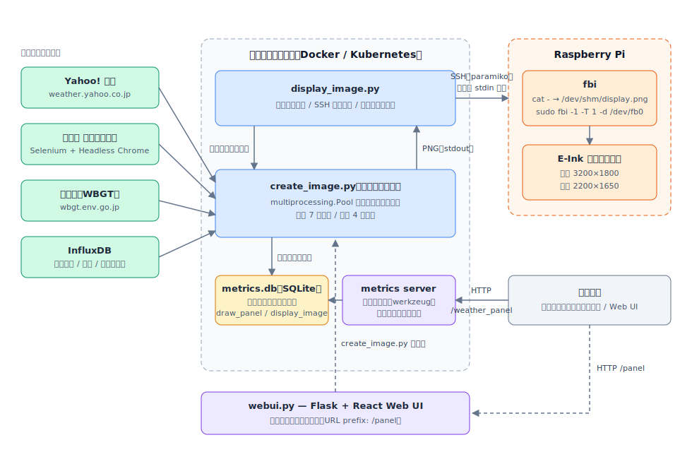
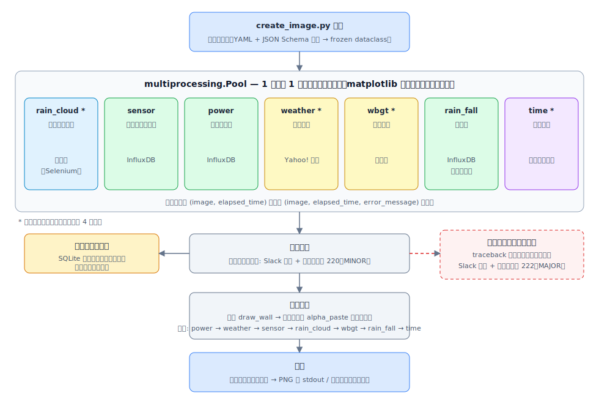
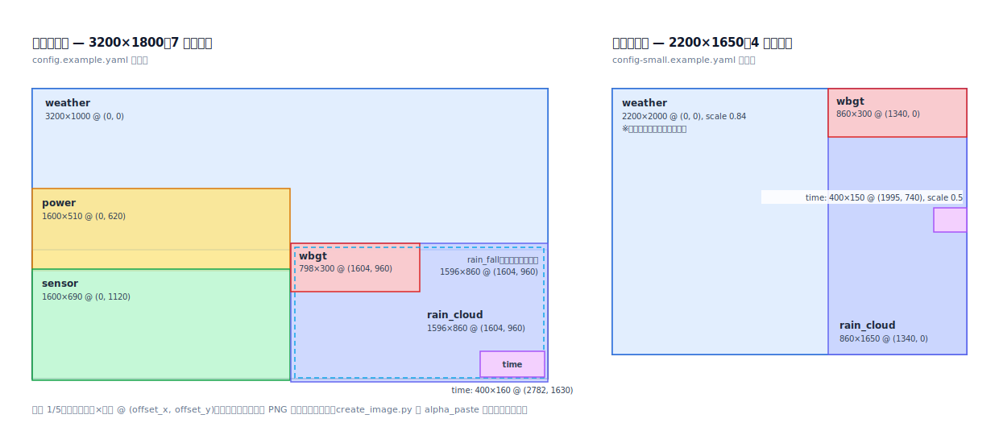
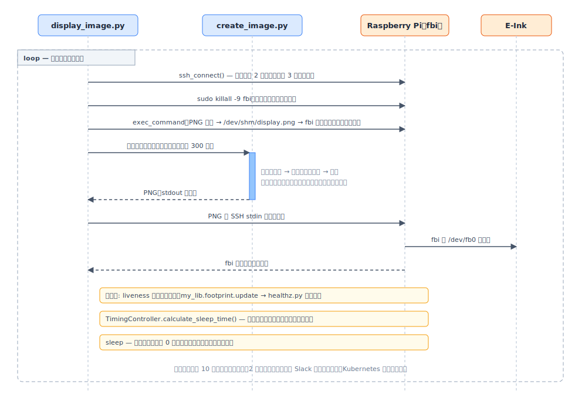
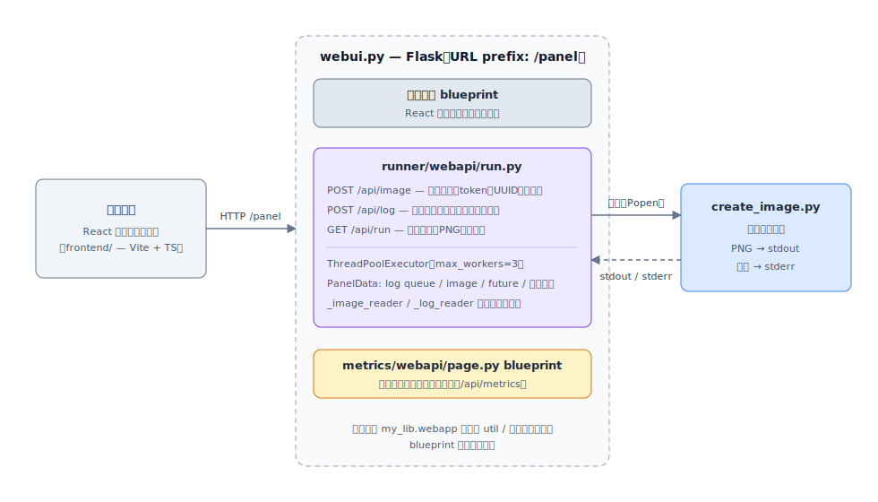
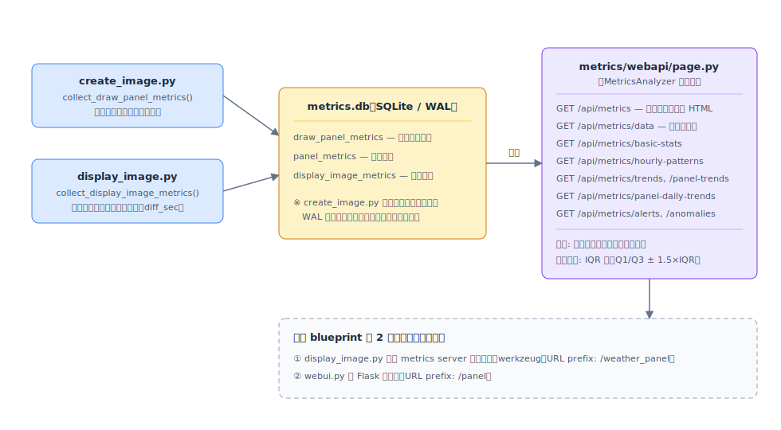

# アーキテクチャ

E-Ink Weather Panel は、気象情報を集約した画像をサーバー側で生成し、SSH 経由で Raspberry Pi
に転送して E-Ink ディスプレイに表示するシステムです。本ドキュメントでは、実際のコードに基づいて
各コンポーネントの構成と処理の流れを説明します。

## 目次

- [システム全体像](#システム全体像)
- [エントリポイント](#エントリポイント)
- [画像生成 (create_image.py)](#画像生成-create_imagepy)
- [パネルレイアウト](#パネルレイアウト)
- [表示更新サイクル (display_image.py)](#表示更新サイクル-display_imagepy)
- [タイミング制御 (timing_filter.py)](#タイミング制御-timing_filterpy)
- [Web UI (webui.py)](#web-ui-webuipy)
- [メトリクス収集と可視化](#メトリクス収集と可視化)
- [設定管理 (config.py)](#設定管理-configpy)
- [ヘルスチェックとデプロイ](#ヘルスチェックとデプロイ)
- [エラーコード](#エラーコード)

## システム全体像



処理の流れは次の 4 段階です。

1. `display_image.py` がメインループとメトリクスサーバー（別スレッド）を起動する
2. 更新サイクルごとに `create_image.py` をサブプロセスとして起動する
3. `create_image.py` が `multiprocessing.Pool` で各パネルを並列描画し、合成した画像を
   グレースケール PNG として stdout に出力する
4. `display_image.py` が PNG を SSH（paramiko）経由で Raspberry Pi に転送し、`fbi` で
   フレームバッファ（`/dev/fb0`）に表示する

このほかに、ブラウザからオンデマンドで画像生成できる Web UI（`webui.py`）と、
処理時間などを可視化するメトリクスダッシュボードがあります。

## エントリポイント

| スクリプト             | 役割                                                                             |
| ---------------------- | -------------------------------------------------------------------------------- |
| `src/display_image.py` | メインループ。SSH 接続管理、`create_image.py` の起動、メトリクスサーバーの起動  |
| `src/create_image.py`  | 画像生成。パネルの並列描画と合成。単体でも CLI として実行可能                   |
| `src/webui.py`         | Flask ベースの Web UI サーバー。React フロントエンドと画像生成 API を提供       |
| `src/healthz.py`       | Kubernetes liveness probe。liveness ファイルの更新時刻を検査                    |

## 画像生成 (create_image.py)



### 並列描画

matplotlib はマルチスレッドに対応していないため、`multiprocessing.Pool` を使って
**1 パネル 1 プロセス**で並列描画します（`draw_panel()`）。プールのプロセス数はパネル数と
同じで、標準モードでは 7 パネル、小型モードでは 4 パネル（`rain_cloud` / `weather` /
`wbgt` / `time`）です。

### パネル一覧 (`src/weather_display/panel/`)

| パネル       | モジュール              | 内容                                             | データソース                              |
| ------------ | ----------------------- | ------------------------------------------------ | ----------------------------------------- |
| `weather`    | `weather.py`            | 天気予報・気温・降水確率・風・体感温度・服装指数 | Yahoo! 天気（`my_lib.weather` 経由）      |
| `rain_cloud` | `rain_cloud.py`         | 雨雲レーダー画像（現在 + 1 時間後予報）          | 気象庁（Selenium + ヘッドレス Chrome）    |
| `sensor`     | `sensor_graph.py`       | 各部屋の温度・湿度・CO2・照度グラフ              | InfluxDB（`fetch_data_parallel` で並列取得）|
| `power`      | `power_graph.py`        | 消費電力グラフ                                   | InfluxDB                                  |
| `wbgt`       | `wbgt.py`               | WBGT 暑さ指数（フェイスアイコン表示）            | 環境省 熱中症予防情報サイト               |
| `rain_fall`  | `rain_fall.py`          | 現在の降水量オーバーレイ                         | InfluxDB（雨量センサー）                  |
| `time`       | `time.py`               | 現在時刻（Asia/Tokyo）                           | システム時計                              |

各パネルモジュールは共通のインターフェースを持ちます。

```python
def create(config: AppConfig) -> tuple[PIL.Image.Image, float] | tuple[PIL.Image.Image, float, str]:
    """
    戻り値:
        - (image, elapsed_time): 成功時
        - (image, elapsed_time, error_message): エラー時
    """
```

補足:

- `weather.py` は Yahoo! 天気の予報・服装指数と環境省の WBGT を
  `concurrent.futures.ThreadPoolExecutor` で並行取得します。
- `rain_cloud.py` は気象庁の雨雲レーダーページを Selenium で開き、地図タイル部分を
  スクリーンショットとして取得します（現在と「+1 時間」の 2 枚）。

### エラーハンドリング

- 個別パネルの描画に失敗した場合は Slack に通知し（`my_lib.panel_util.notify_error`）、
  終了コードを `220`（MINOR）にして処理を継続します。失敗したパネルにはエラー画像が
  表示されるため、全体の表示は止まりません。
- 描画処理全体で例外が発生した場合は、traceback を書き込んだエラー画像を生成して
  Slack に通知し、終了コード `222`（MAJOR）で終了します。

### 合成と出力

1. 壁紙を描画（`draw_wall()`）
2. 各パネルの透過 PNG を `power → weather → sensor → rain_cloud → wbgt → rain_fall → time`
   の順に `my_lib.pil_util.alpha_paste` で重ね合わせ
3. グレースケールに変換した PNG を stdout（または `-o` 指定のファイル）へ出力

また、パネルごとの処理時間・エラー状態をメトリクス DB（SQLite）に記録します。
`create_image.py` は毎サイクル新規プロセスとして親プロセスが使用中の DB に接続するため、
接続時に WAL ファイルを削除しないよう `suppress_wal_cleanup()` で抑止しています。

## パネルレイアウト

設定ファイル（`config.example.yaml` / `config-small.example.yaml`）で定義されている
各パネルの配置は次のとおりです。`wbgt` と `rain_fall` は `rain_cloud` の上に重ねて
描画されるオーバーレイです。



## 表示更新サイクル (display_image.py)



`display_image.py` のメインループ（`start()` → `execute()`）は、サイクルごとに次を行います。

1. 前サイクルの SSH 接続をベストエフォートで閉じ、新規に SSH 接続を確立する
   （`_exec_patiently()` により失敗時は 2 秒間隔で最大 3 回リトライ）
2. 残存している `fbi` プロセスを `sudo killall -9 fbi` で回収する
3. Raspberry Pi 側で `cat - > /dev/shm/display.png && sudo fbi -1 -T 1 -d /dev/fb0 --noverbose
   /dev/shm/display.png` を実行するコマンドを準備する
4. `create_image.py` をサブプロセスとして起動する（タイムアウト 300 秒。超過時は
   セッション単位で SIGTERM → SIGKILL により強制終了）
5. サブプロセスの stdout（PNG）を SSH の stdin に書き込み、`fbi` の終了ステータスを確認する
6. 成功時（および一部パネル失敗の 220 時）は liveness ファイルを更新する
   （`my_lib.footprint.update` — `healthz.py` が監視）
7. `TimingController` で次回までのスリープ時間を計算して待機する

例外発生時は 10 秒待ってリトライし、2 回連続（`NOTIFY_THRESHOLD`）で失敗すると Slack に
通知してプロセスを終了します（Kubernetes 環境では再起動により復旧）。`SIGTERM` / `SIGINT`
受信時は `threading.Event` によりスリープ中でも即座にグレースフルシャットダウンします。

## タイミング制御 (timing_filter.py)

表示が更新されたことを直感的に把握しやすくするため、**更新完了タイミングを毎分 0 秒に
揃えて**います。画像生成にかかる時間はパネルのデータ取得状況によって変動するため、
1 次元カルマンフィルタ（`TimingKalmanFilter`）で所要時間を推定し、スリープ時間を逆算します。

- 状態: 実行時間の推定値（初期値 30 秒）
- プロセスノイズ Q = 0.5、観測ノイズ R = 2.0
- `TimingController.calculate_sleep_time()` が
  `sleep_time = update_interval - 推定実行時間 - 現在の秒` を計算し、
  負になる場合は次の周期に繰り越します
- 目標秒からのずれ（`diff_sec`）が 3 秒を超えると警告ログを出し、値はメトリクスにも
  記録されます

## Web UI (webui.py)



`webui.py` は Flask アプリ（URL prefix: `/panel`）で、以下の blueprint を登録します。

- **静的配信** — React フロントエンド（`frontend/`、Vite + TypeScript）のビルド成果物
- **`runner/webapi/run.py`** — `create_image.py` の非同期実行 API
- **`metrics/webapi/page.py`** — メトリクスダッシュボード

### 画像生成 API (`runner/webapi/run.py`)

| エンドポイント           | メソッド | 内容                                             |
| ------------------------ | -------- | ------------------------------------------------ |
| `/panel/api/image`       | POST     | 画像生成を開始し、token（UUID）を発行            |
| `/panel/api/log`         | POST     | 生成中のログを取得（queue からストリーミング）   |
| `/panel/api/run`         | GET      | token を指定して完成画像（PNG）を取得            |

生成リクエストは `ThreadPoolExecutor`（`max_workers=3`）で処理され、token ごとに
`PanelData`（ログ queue・画像バッファ・future・完了時刻）を保持します。サブプロセスの
stdout（PNG）と stderr（ログ）は `_image_reader` / `_log_reader` スレッドが回収します。

## メトリクス収集と可視化



### 収集 (`metrics/collector.py`)

SQLite（WAL モード）に以下のテーブルで記録します。

| テーブル                | 記録元             | 内容                                       |
| ----------------------- | ------------------ | ------------------------------------------ |
| `draw_panel_metrics`    | `create_image.py`  | 画像生成全体の処理時間・モード・エラー     |
| `panel_metrics`         | `create_image.py`  | パネル別の処理時間・エラーメッセージ       |
| `display_image_metrics` | `display_image.py` | 表示処理時間・成否・スリープ時間・`diff_sec` |

### 分析・可視化 (`metrics/webapi/page.py`)

`MetricsAnalyzer` が集計を行い、ダッシュボード HTML と JSON API
（`/api/metrics/basic-stats`、`/api/metrics/hourly-patterns`、`/api/metrics/trends`、
`/api/metrics/alerts`、`/api/metrics/anomalies` など）を提供します。

- 統計量は箱ひげ図形式（四分位数・外れ値）で算出
- 異常検知は **IQR 法**（`Q1 − 1.5×IQR` 〜 `Q3 + 1.5×IQR` の範囲外を異常と判定）

この blueprint は 2 箇所から提供されます。

1. `display_image.py` 内で起動されるメトリクスサーバー
   （`metrics/server.py`、werkzeug をデーモンスレッドで実行、URL prefix: `/weather_panel`）
2. `webui.py` の Flask アプリ（URL prefix: `/panel`）

## 設定管理 (config.py)

- YAML 設定を JSON Schema（`schema/config.schema` / `schema/config-small.schema`）で検証した
  うえで、**frozen dataclass**（`AppConfig`）にパースします。全設定が不変・型安全です。
- `FontConfig` / `PanelGeometry` / `InfluxDBConfig` などの共通型は `my_lib` から re-export
  しています。
- 表示モードは 2 種類で、モードごとに設定ファイルとスキーマを切り替えます。

| モード | 解像度    | パネル数 | 設定例                      |
| ------ | --------- | -------- | --------------------------- |
| 標準   | 3200×1800 | 7        | `config.example.yaml`       |
| 小型   | 2200×1650 | 4        | `config-small.example.yaml` |

## ヘルスチェックとデプロイ

- **liveness ファイル**: 表示に成功するたびに `display_image.py` が
  `config.liveness.file.display` を更新します。`healthz.py` は `my_lib.healthz` を使い、
  更新間隔（`panel.update.interval`）を基準にファイルの鮮度を検査します。
- **Docker**: `tini` を init として `uv run src/display_image.py` を起動します
  （ヘッドレス Chrome を同梱）。
- **Kubernetes** (`kubernetes/eink-weather-panel.yaml`): namespace `panel`、replicas 1。
  liveness probe は `uv run --no-group dev src/healthz.py` を initialDelay 120 秒、
  period 60 秒で実行します。メモリは requests 512Mi / limits 2Gi です。

## エラーコード

| コード | 定数               | 意味                                                       |
| ------ | ------------------ | ---------------------------------------------------------- |
| 220    | `ERROR_CODE_MINOR` | 一部パネルの描画に失敗（表示は継続、liveness も更新される）|
| 222    | `ERROR_CODE_MAJOR` | 描画全体が失敗（エラー画像を表示）                         |

`display_image.py` は `create_image.py` がこれら以外の想定外コードで終了した場合
（設定エラーや OOM-kill など）に `RuntimeError` を送出します。
